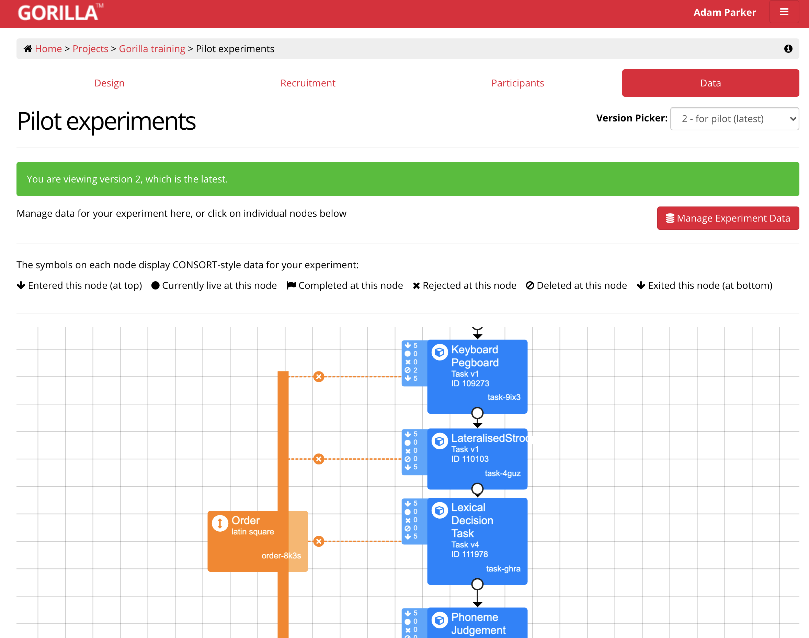
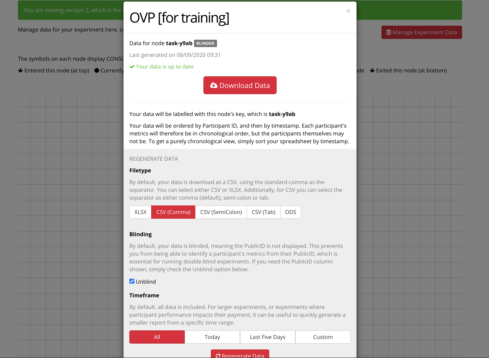
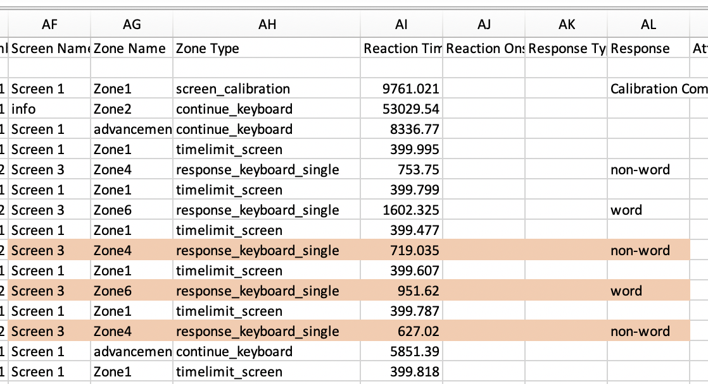

```{r setup, include=FALSE}
knitr::opts_chunk$set(echo = TRUE)
```

The markdown describes how to pull the data into R and process it to make something usable. This this based on the OVP task that I had used to examine whether the right visual field advanatge occurs early or late during processing. 

## Downloading the data

To get the data navigate to Home > Projects > Gorilla training > Pilot Experiment



Then click on the task you’d like to download data for. The first time you do this you will have to generate the data. When doing this make sure that you click unblind. When this is done, download your data file.  



Now you are ready to read in the data and prepare it for some simple aggregation. This has been adapted from this walk through: https://emljames.github.io/GorillaR/GorillaR_Part1.html. 

```{r read}
# install tidyverse
library(tidyverse)
# read data
dat <- read.csv("data_exp_24728-v2_task-y9ab.csv", na.strings = c("NA", ""))
```

Now that the data is read in, lets filter it down to soemthing useable. To do this we need to identify the zone.type associated with the response. The can be easily done in excel or R.

In my data, the zone type *response_keyboard_single* is recording the button press, so we use this to pick out button presses. 



Here, by using the *display* column we can also remove practice trials. In my data, I only want the *Task* display.

```{r filtering}
# first, let's use the filter function to trim this
dat <- dat %>% 
  filter(Zone.Type == "response_keyboard_single" & # choose the zone that gives the repsonse
         display == "Task") # choose the screen that is the task
# now let's output the number of responses per participant to check this looks somewhat sensible
dat %>%                             
  group_by(Participant.Private.ID) %>%    
  count()  
```

Gorilla gives us a lot more information than we need. Let's select the variables that we actually want for further analysis

```{r select}
# first, let's print the names of the rows so that we can see what we want
names(dat)
# now, select what we want
trial_data <- dat %>%
  select(Participant.Private.ID, ANSWER, Correct, Reaction.Time, blur, VF, string)
# we can also rename these to make things a little easier (so that we don't have to type long names)
trial_data <- trial_data %>% 
  rename(ID = Participant.Private.ID,
         answer = ANSWER,
         acc = Correct,
         RT = Reaction.Time,
         item = string
         )
# again, check to see if it makes sense
head(trial_data)
```

This looks good. Now we have the data prepare let's approach outliers. This is based on my asPredicted protocol and will need adpating to suit yours. I'd pre-regsitered a few outlier removal strategies: 

- first, remove inaccurate trials

- remove trials where RT was less than 250 and greater than 1200. 

- Due to potential issues with buffering and poor internet connections when completing the task, we will use the criteria outlined by Hoaglin-Iglewicz to exclude outliers in the data for reaction time for each individual subject after removing reaction times less than 250 ms and longer than 1200 ms. Our cut-off criterion will be set to 1.65 instead of the typical 2.2. This is because we expect to obtain asymmetric distributions for reaction time, since reaction time is always non-negative, and so most outliers will be in one tail of the distribution. 

So that we can calculate accuracy correctly later on, make sure to code the outliers as NA. 

```{r outliers}
# first, let's use mutate to create some new variables. If else does this conditionally
trial_data <- trial_data %>% 
  mutate(accRT = ifelse(acc == 1, RT, NA), # create RT for accurate response
         accRT = ifelse(accRT > 250 & accRT < 1200, accRT, NA)) # now remove short and long RT

# Now we will apply the Hoaglin and Iglewicz procedure [YOU MOST LIKLEY CAN IGNORE THIS]
trial_data <- 
  trial_data %>% 
  group_by(ID) %>%
  mutate(
    # Identify 25th and 75th quartiles of trial_data, and the difference between them
    lower_quartile <- quantile(trial_data$accRT, probs=0.25, na.rm="TRUE"),
    upper_quartile <- quantile(trial_data$accRT, probs=0.75, na.rm="TRUE"),
    quartile_diff <- upper_quartile - lower_quartile,
    # Outliers are defined as being below or above 2.2 times the quartile difference
    lower_limit <- lower_quartile - 1.65*quartile_diff,
    upper_limit <- upper_quartile + 1.65*quartile_diff,
    # create variable
    accRT= ifelse(accRT >= upper_limit | accRT <= lower_limit, NA, accRT))

# now neaten up after HI outlier removal
trial_data <- trial_data[,1:8]
```

Now that we have the outliers removed, let's create some averaged data.

We use group_by() to specify that level of specifity that we want the data. Using ID will give a summary of accuracy and RT for subjects only. To get more we need to specify the variables that we manipulated (in my case these are blue and VF).

```{r summary}
participant_data <- trial_data %>% 
  group_by(ID, blur, VF) %>% 
  summarise(meanAcc = mean(acc), 
            meanRT = mean(accRT, na.rm = TRUE))
```

Now that we have this data, let's very quickly visualise this so that we can get an impression of the data. 

Here we'll use a boring plot that tells you nothing about the distrbution or spread of the data-- aka, change this. 

```{r visual}
library(ggplot2)
# Because we have aggregate data at the subject level, we actually need to aggregate this one step further for the plot
agg_data <- participant_data %>% 
  group_by(blur, VF) %>% 
  summarise(meanAcc = mean(meanAcc), 
            meanRT = mean(meanRT, na.rm = TRUE))
# plot
p<-ggplot(agg_data, aes(x=VF, y=meanRT, group=blur)) +
        geom_line(aes(color=blur))+
        geom_point(aes(color=blur))
p+scale_color_brewer(palette="Dark2")+theme_classic(18)
```